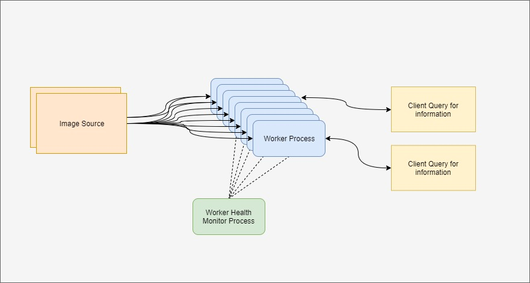

# Distributed Detection

This repository is a final project for my Resilient Distributed Systems class. A multi-worker image processing system is implemented. Images are received at regular intervals from one or multiple sources and worker processes detect objects in these images. Workers distribute computational load in a decentralized manner, and data is stored in a decentralized manner as well. The database is structured for availability, functionality when partitioned, and eventual consistence (assuming no malicious workers). A simple monitoring process is also used for basic fault detection and management. The following requirements will be met:
- System functions as long as one worker process is active (high availability)
- Database querying is done using all currently active database nodes (partition-tolerant)
- Data is stored as (incomplete) replicas in each process and is iteratively checked against majority of worker processes and adjusted to the majority value (eventual consistency)
- Audit system used to check processes occasionally against 2 other processes
- Component process health monitor detects and restarts faulty processes

## Design Specification
### 1. System Actors
The main actors in the system are the worker processes which perform object detection on incoming images and store results. The monitoring process is an additional actor. While the image-sender and database query clients are involved in the operation of the system, they are considered separate to the system (i.e. the system is not designed to be robust to their failure and it is assumed that they do not deviate from expected operating behavior.

### 2. Summary of System Workflow
Each worker process is designed to operate more or less independently from each other worker process. While there is communication between workers to coordinate load balancing, majority responses to query requests, results audits and database consistency, all of these actions are performed with a fixed

Process flow diagram for one worker process shown below.

### 3. External Libraries and Services Required
text here

### 4. System Failure Modes and Anomaly Detectors
text here

### 5. Failure Mitigation Strategies
text here

